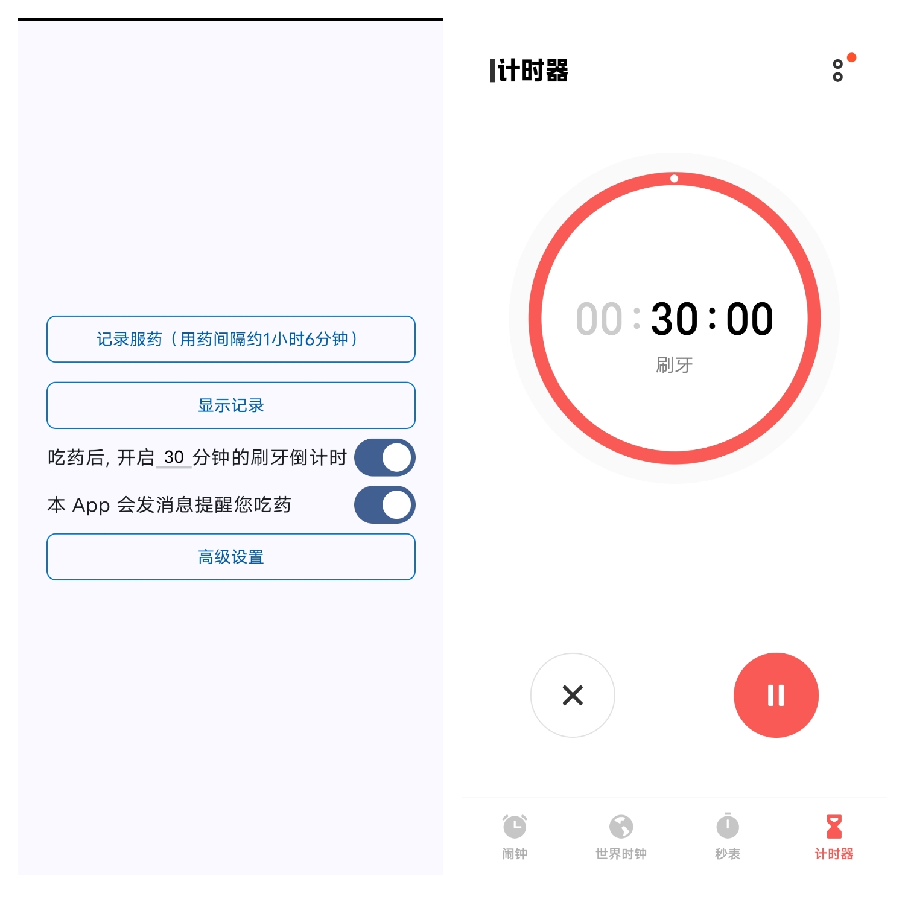
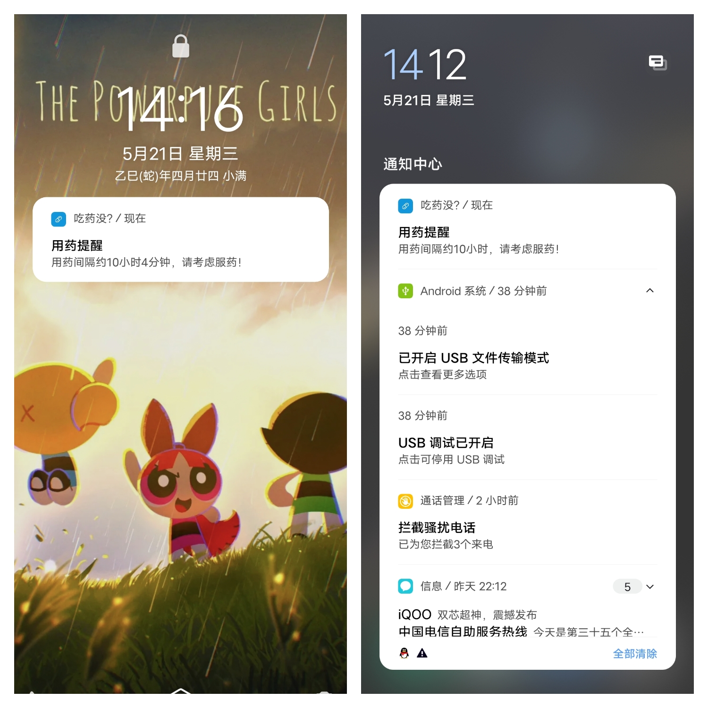
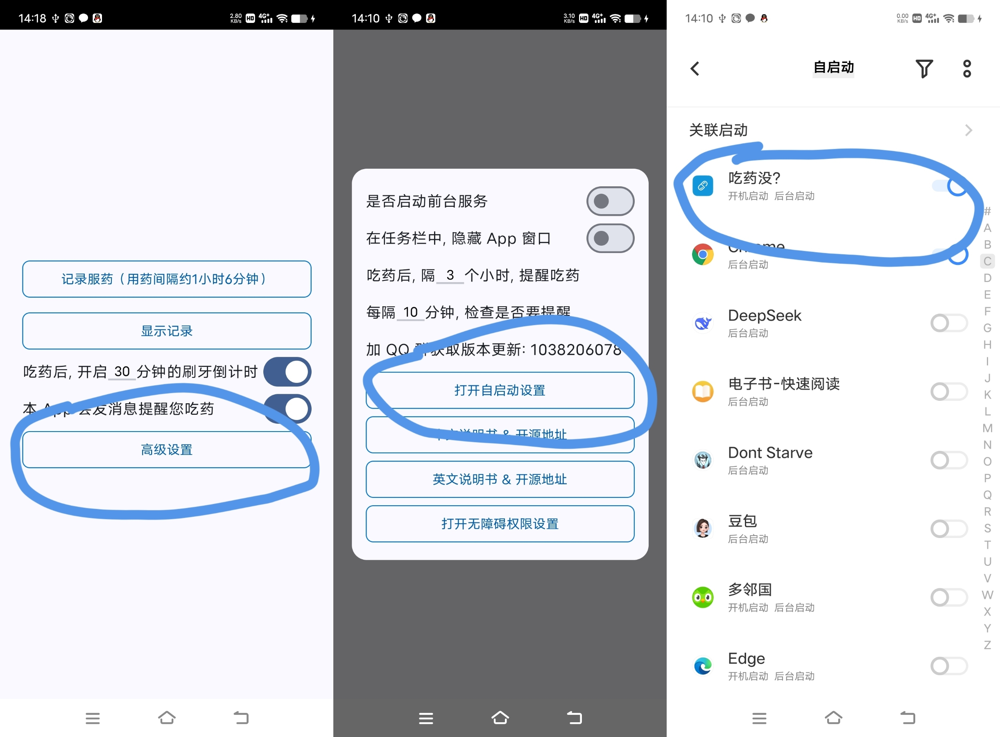
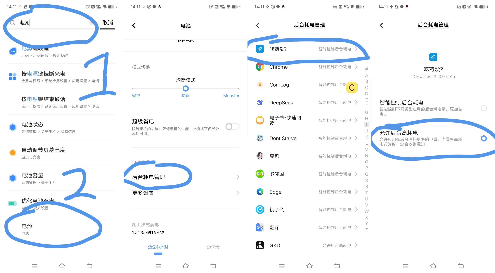

# 吃药没? 软件说明书 水果玉米系列

> 水果玉米没有特殊含义, 仅仅只是方便搜索的关键字, 来源于我的一顿早餐

## 软件的功能

快速记录服药信息，避免漏服或重复服药

## 下载地址

gitee release: https://gitee.com/HHandHsome/did-i-take-my-meds/releases/tag/v1.1.2

github release: https://github.com/HHsomeHand/did-i-take-my-meds/releases/tag/v1.1.2

找到带 apk 的字样, 点击下载即可

## 预览





## 如何使用 (必读)

由于国产~~乱改~~的 Android 系统的后台管理非常严格, ~~只能向厂家交保护费来保证自己的App可以后台允许~~, 所以我们普通开发者, 必须要另辟蹊径, 来确保自己的 App, 不会被厂商的~~傻吊~~系统给乱杀掉, 以此来给用户提供服务.

声明: 本软件完全离线，绿色且安全，甚至没有申请联网权限。

### 自启动白名单

 后台服务需要自启动, 启动后, 执行时间的判断逻辑, 才能给您提供发消息的服务



### 允许后台耗电

后台服务需要执行逻辑, 执行逻辑就需要耗电, 耗电就容易被 国改android 停止掉服务



### 无障碍

这里需要无障碍权限, 提升服务的优先级, 避免被操作系统停止


> To 安卓开发者同好: 软件最大的难点，在于安卓的后台服务保活，详细解决方案请看:
>
> https://mp.weixin.qq.com/template/article/1747807756/index.html
>
> 前台服务不是金钥匙, 在睡眠或省电模式下依旧会被杀掉, 只有无障碍才能完全保活

### 获取更新

为了保证软件完全离线，所以没有加入自动更新机制。

同时，国内的应用市场上架APP，都需要软件著作权。

而注册软件著作权需要 200 块，实在是没有必要。

所以本软件弄了一个交流群，方便大家获取更新信息。

群号: 1038206078

加群暗号: 123456

## 介绍 & 软件的灵感来源

### 致敬前辈

Github: https://github.com/CorruptedArk/did-i-take-my-meds

非常优秀的软件, 帮助我记录了很多次的服药. 但我个人觉得无法满足自己的需求, 于是动手写了一个软件

###本软件的前身 玉米日志:

玉米日志是款强大的软件, 界面高度自定义, 而且使用场景不仅仅只局限于记药

Gitee: https://gitee.com/HHandHsome/pwa-corn-log

这款软件也是我开发, 但受限于这款软件使用的技术, 导致这款软件的上限被卡死了, 无法更进一步, 实现更为强大的功能

于是我另起炉灶, 重新用新技术, 实现了我心中的记药软件

### 本软件

我重新用不同的技术，重新写了一个 APP，单独编写了玉米日志的药律模块，以支持更为强大的功能。

软件功能: 快速记录服药信息，避免漏服或重复服药

+ 功能1) 在固定服药间隔后，通过操作系统，发通知，提示服药

+ 功能2) 服药经常和吃饭一块，所以软件记药后，使用操作系统自带的闹钟软件，进行倒计时，提醒刷牙

## 技术相关

项目技术栈: 安卓原生 + kotlin + jetpack compose

### 学习资料推荐

> 书籍都可以买二手的, 比较便宜

第一行代码 第三版 郭霖老师的: https://book.douban.com/subject/34996842/

jetpack compose 入门系列教程 也是郭霖老师的: https://mp.weixin.qq.com/s/n-_-LcMZokgmgYS7-wgk2g

android 动态权限申请库 郭霖老师的: https://mp.weixin.qq.com/s/7RpGzTjXo9rnHRCVEnrYWQ

+ 库地址: https://github.com/guolindev/PermissionX/issues

+ jetpack compose 中使用 PermissionX, 我自己写的随记: https://blog.csdn.net/RedDragon_Will/article/details/147860588

郭霖老师的 Flow 三部曲, 用于取代 LiveData 和实现事件总线: https://mp.weixin.qq.com/s/TRr_isgU7VVVuJ9rOMZUhw

这些就相当够用了


### 本软件架构

使用了 ViewModel 做全局状态管理

Flow 做 响应式数据(MutableStateFlow) + 事件总线(MutableSharedFlow)

jetpack compose 代替传统 View 布局


### jetpack compose vs flutter

我个人认为 jetpack compose 是比 flutter 更好用的。

因为 jetpack compose 诞生时间比 flutter 晚, 所以语法更现代

#### kotlin vs dart

jetpack compose 是基于 kotlin 的, kotlin 设计得比 dart 要优雅

kotlin 的语法是比 dart 更舒服的，数据类、单例类的语法糖都很好用。

```kotlin
// kotlin
// User 数据类
data class User(val id: Int, val name: String)

// Singleton 单例类
object Singleton {
    fun doSomething() {
        println("Singleton is working!")
    }
}
```

```dart
// dart
class User {
  final int id;
  final String name;

  User(this.id, this.name);

  @override
  String toString() => 'User(id: $id, name: $name)';
}

class Singleton {
  static final Singleton _instance = Singleton._internal();

  factory Singleton() => _instance;

  Singleton._internal();

  void doSomething() {
    print('Singleton is working!');
  }
}
```

#### 组件对比

```kotlin
@Composable
fun Section() {
    Column(
        modifier = Modifier.padding(16.dp)
    ) {
        Button(onClick = { /*TODO*/ }) {
            Text("Button 1")
        }
        
        Button(onClick = { /*TODO*/ }) {
            Text("Button 2")
        }
        
        Button(onClick = { /*TODO*/ }) {
            Text("Button 3")
        }
    }
}

```

```dart
import 'package:flutter/material.dart';

class Section extends StatelessWidget {
  @override
  Widget build(BuildContext context) {
    return Column(
      children: [
        ElevatedButton(
          onPressed: () {},
          child: Text("Button 1"),
        ),
        ElevatedButton(
          onPressed: () {},
          child: Text("Button 2"),
        ),
        ElevatedButton(
          onPressed: () {},
          child: Text("Button 3"),
        ),
      ],
    );
  }
}

```

会 flutter 上手 jetpack compose 非常快，getx 对应过来就是 viewmodel。

jetpack compose 唯一比较弱势的地方就是生态, jetpack compose 的生态很小, 就拿 Color Picker 组件举例, flutter 社区有很多好用的控件, 但是 compose 没多少. 

而且 jetpack compose 目前虽然已经是稳定版了, 但是大量的 api 仍然是 `实验性` 特性, 还不完全稳定, api 变化大.

## 尾声

感谢阅读和使用, 如有任何问题, 欢迎提 Gitee & GitHub issue, 或是直接联系我


